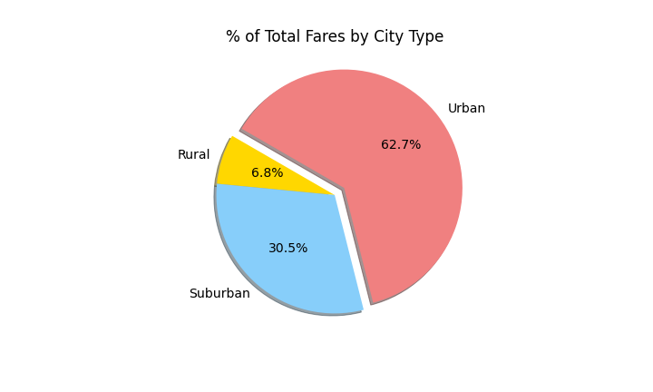

# PyBer_Analysis

It's your second week as a data analyst at PyBer, a ride-sharing app company valued at $2.3 billion. You've just been assigned your first big project: analyze all the rideshare data from January to early May of 2019 and create a compelling visualization for the CEO, V. Isualize.

Python v3.9.7 | matplotlib v3.5.1 | Pandas v1.3.4 | Anaconda v4.12.0

## Deliverable 1: A ride-sharing summary DataFrame by city type

You will earn a perfect score for Deliverable 1 by completing all requirements below:

• The total number of rides for each city type is retrieved.

• The total number of drivers for each city type is retrieved.

• The sum of the fares for each city type is retrieved.

• The average fare per ride for each city type is calculated.

• The average fare per driver for each city type is calculated.

• A PyBer summary DataFrame is created.

• The PyBer summary DataFrame is formatted as shown in the example.

The code and output for the PyBer Summary DataFrame is below:

## Deliverable 2: A multiple-line chart of total fares for each city type

You will earn a perfect score for Deliverable 2 by completing all requirements below:

• A DataFrame was created using the groupby() function on the "type" and "date" columns, and the sum() method is applied on the "fare" column to show the total fare amount for each date and time:

• A DataFrame was created using the pivot() function where the index is the "date," the columns are the city "type," and the values are the "fare":

• A DataFrame was created using the loc method on the date range: 2019-01-01 through 2019-04-28:

• A DataFrame was created using the resample() function in weekly bins and shows the sum of the fares for each week:

• An annotated chart showing the total fares by city type is created and saved to the "analysis" folder:

## Deliverable 3: A written report for the PyBer analysis

### Overview

This project was initiated to explore the relationships between various metrics reporting ride-sharing data in order to identify opportunities to increase or optimize applicability to underserved communities. Our data consists of information from all rides given in 2019 and includes, Fare, Driver, Date, and City.

### Results

First, let's consider some visualizations of ride-sharing data, grouped by Urban, Suburban, and Rural cities in 2019. This plot shows the average fare, number of rides, and total drivers per city. It is further grouped by City Type, shown by the size of the circle as noted below the X-Axis:

Clearly, the Urban cities utilize ride-sharing services far more frequently than Suburban and Rural cities but the number of rides and fare are shared by far more drivers. Additionally, the number of rides and fare in Suburban cities are greater than Rural cities by the same order of magnitude as the relationship between Urban and Suburban. Again, rides and fares are shared by more drivers in Suburban cities than in Rural cities. Rural cities have considerably higher average fares then other city types and Suburban cities have slightly higher average fares than Rural cities.

Next, let's look at the variance of the distribution of rides, fares, and drivers grouped by city types:

These charts show that Urban cities have much more variation in number of rides and drivers while Suburban cities have greater variance in the number of drivers and rides than Rural cities. The Ride Count box/whisker chart for Urban cities identifies a single outlier that has not been removed from additional calculations.

Rural cities are shown to have the most variance in fares with Urban cities showing the least variance. Note that the difference in variance is not as extreme between city types with regards to fares but there is considerable fare variance with each type as opposed to the number of rides and drivers.

Variance in the number of drivers and rides in Rural cities is relatively very small compared to all other variance metrics.

Looking at the distribution of Rides, Fares, and Drivers between city types shows that Urban cities clearly get the lion's share of services while Rural cities get a small fraction of each:

Note that Rural cities have the fewest Drivers but utilize them to provide a larger proportion of rides and an even larger share of the fares. 

### Summary

Populations in Urban cities are receiving much better service than suburban and Rural cities. There are far more rides provided by a much larger number of drivers. In each metric, data for Suburban cities fits neatly between totals and averages for Urban and Rural cities.

There appears to be an inverse relationship between the level of service provided in each city type and the profitability of the drivers that serve those areas; drivers in Rural cities are providing more rides for larger fares than drivers in Suburban cities, who in turn provide more rides for slightly larger fares than drivers in Urban cities.

To address this disparity between service in city types, increased incentivization to recruit drivers in Rural cities should be considered. Additionally, the creation of service levels in Urban areas should be examined in order to increase the average fare for Urban drivers to include combining rides for single passengers in the lowest service tier. An additional change in service structure could encourage Urban and Suburban drivers to serve Rural areas by offering an express service from these city types to Rural cities so allow more fluid driver counts between city types.

The lack of data on drive length and drive time are a limiting factors in this analysis. While this could be inferred from the average fares, it is not possible to glean clear insight on how the ride time and distance relate to other metrics. I would encourage pulling this data for further analysis and for future reporting.
